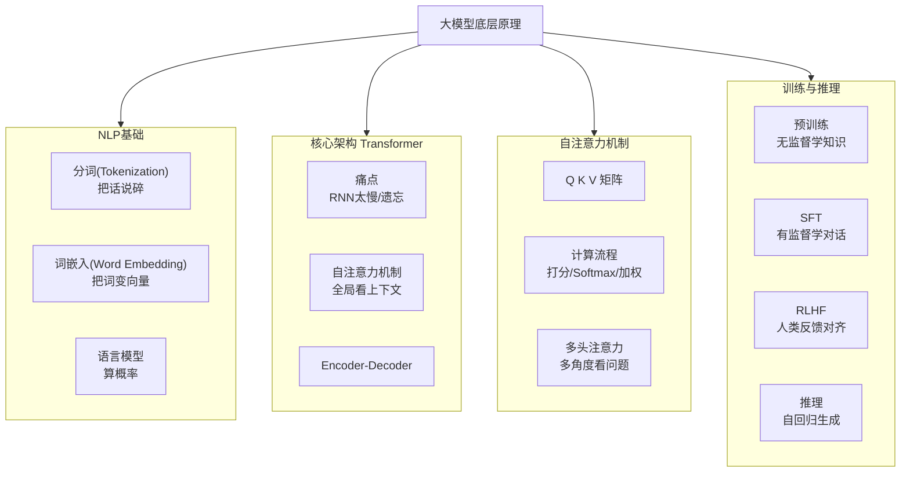

# 从分词到对话：大语言模型（LLM）底层原理的通俗讲义

很多人觉得大模型很神秘，好像是个黑盒。其实如果把它拆开来看，它的逻辑非常朴素：**先把文字切成小块，再把小块变成数字，最后用一套极其精妙的数学公式（Transformer）去计算这些数字之间的关系。**

为了让你一眼看清全貌，我画了一张全链路思维导图。本文会严格按照这张图的脉络，带你走完从“文字”到“智能”的全过程。

---

## 一、NLP基础：机器是怎么“读”书的？

在模型理解世界之前，它必须先学会处理人类的语言。

### 1. 分词：打破语义的壁垒
计算机不认识字，只认识数字。第一步就是把句子拆成最小单元（Token）。
*   **中文**：“我爱自然语言处理” → `["我", "爱", "自然语言处理"]`
*   **英文**：`"I love NLP"` → `["I", "love", "NLP"]`

现在的模型（如GPT）常用 **BPE（字节对编码）**，它不一定按词切，而是按高频字符组合切，这样能解决生僻词的问题。

### 2. 词嵌入：寻找语言的“坐标系”
以前的老方法是“独热编码”（One-hot），词与词之间是完全孤立的。现在的做法是 **Word Embedding**。
想象一个多维空间：
*   “国王” - “男人” + “女人” ≈ “女王”
*   “北京” - “中国” + “法国” ≈ “巴黎”

这就把文字变成了带有**语义关系**的数学向量。

### 3. 语言模型：什么是“人话”？
语言模型的核心任务是计算概率：`P("今天天气不错") > P("今天不错天气")`。
模型越庞大，它对“下一句该说什么”的判断就越精准。

---

## 二、为什么是 Transformer？

在2017年之前，大家用 RNN 或 LSTM 来处理语言。它们有个致命伤：**串行处理**。
就像读一本书，必须从左到右一个字一个字读，读到最后，前面的内容就忘了（长距离遗忘）。而且没法并行计算，训练极慢。

**Transformer 的出现改变了这一切。** 它抛弃了循环结构，改用 **Self-Attention（自注意力）**。这意味着，在处理一句话时，每个词都能**同时看到**句子里的所有其他词。

### 架构简析
Transformer 主要由两部分组成：**编码器（Encoder）** 和 **解码器（Decoder）**。
*   **Encoder**：负责“读懂”输入（理解）。
*   **Decoder**：负责“生成”输出（创作）。

目前的 ChatGPT、Claude、DeepSeek 等对话模型，大多是基于 **Decoder-Only** 架构，因为它们更擅长“续写”和“生成”。

---

## 三、自注意力机制：模型的“灵魂”

这是大模型最核心的魔法。我们用一个简单的“餐厅找人”来类比：

假设你在餐厅喊一声：“**苹果**在哪？”
*   **Query (Q)**：你的喊话（“苹果”）。
*   **Key (K)**：每个人手里举着的牌子（标识自己是谁）。
*   **Value (V)**：每个人手里实际拿的东西（内容）。

**计算过程：**
1.  你用 Query 去匹配所有人的 Key。
2.  发现那个举着“水果”牌子的人，Key 匹配度最高。
3.  于是你把注意力集中在他身上，拿走了他的 Value（苹果）。

**数学上的简化版流程：**
1.  **计算分数**：$Score = Q \times K^T$（点积越大，关系越近）。
2.  **缩放**：$Score / \sqrt{d_k}$（防止数值太大导致梯度消失）。
3.  **归一化**：用 Softmax 把分数变成概率（比如：80%注意力在这，20%在那）。
4.  **加权求和**：用这个概率去乘以 V，得到最终的输出向量。

**多头注意力（Multi-Head）** 则是让模型同时派出好几组“侦察兵”，有的关注语法，有的关注指代关系（比如“它”指的是猫还是狗），最后汇总结果。

---

## 四、训练与推理：从“傻瓜”到“专家”

一个大模型并不是一开始就这么聪明的，它经历了三个阶段的学习。

### 1. 预训练（Pre-training）：博览群书
这是最烧钱的阶段。模型阅读了整个互联网的 TB 级文本。
*   **任务**：Next Token Prediction（预测下一个字）。
*   **例子**：输入“今天天气”，模型预测“真”；输入“今天天气真”，预测“好”。
*   **结果**：模型获得了海量的通识知识，但它还不会聊天，像个只会接话茬的书呆子。

### 2. 监督微调（SFT）：学习礼仪
为了让模型像人一样对话，我们需要给它看大量的“标准答案”。
*   **数据**：几十万条高质量的问答对（Instruction-Response）。
*   **效果**：模型学会了“当用户问 A 时，我应该回答 B”的格式。

### 3. 人类反馈强化学习（RLHF）：价值观对齐
这是让模型变得“好用”的关键。
*   **过程**：模型对一个问题的多个回答进行排序，人类标注员选出最好的。
*   **训练**：用一个“奖励模型”来模拟人类的偏好，告诉大模型：“这个回答很棒，加分；那个回答有毒，扣分。”
*   **结果**：模型学会了拒绝有害信息，回答更有帮助、更安全。

### 4. 推理：为什么是一个字一个字蹦出来？
当你问模型“1+1=?”时，它的生成过程是**自回归**的：
1.  输入 `1+1=?` → 预测出 `答`。
2.  输入 `1+1=?答` → 预测出 `案`。
3.  输入 `1+1=?答案是` → 预测出 `2`。
4.  直到预测出结束符 `<eos>`。

这就是为什么我们在对话框里看到字是一个个跳出来的——因为它确实是在算完一个字后，才能算下一个字。

---

## 总结

大模型并没有那么玄乎。它的本质是一个**基于概率的预测机器**。
1.  **NLP基础**给了它处理语言的能力。
2.  **Transformer**给了它并行计算和全局视野的能力。
3.  **预训练+SFT+RLHF**让它从一本正经的胡说八道，变成了如今能帮我们写代码、做翻译的智能助手。

希望这篇讲义能帮你理清大模型的脉络。如果你对某个具体环节（比如位置编码 RoPE 或者 KV Cache）感兴趣，我们可以继续深入聊聊。