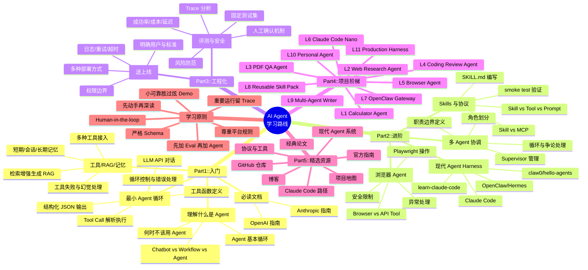

# AiAgent学习路线

---

## 目录

- [思维导图](#思维导图)
- [如何使用本路线](#如何使用本路线)
- [现在该学什么](#现在该学什么)
- [Part 1：入门 — 搞定 Agent 基本功](#part-1入门--搞定-agent-基本功)
  - [Stage 0：理解什么是 Agent](#stage-0理解什么是-agent)
  - [Stage 1：搭建最小 Agent 循环](#stage-1搭建最小-agent-循环)
  - [Stage 2：工具调用、RAG 与记忆](#stage-2工具调用rag-与记忆)
- [Part 2：进阶 — 从能跑到能上线](#part-2进阶--从能跑到能上线)
  - [Stage 3：吃透一个现代 Agent Harness](#stage-3吃透一个现代-agent-harness)
  - [Stage 4：多 Agent 是协调，不是魔法](#stage-4多-agent-是协调不是魔法)
  - [Stage 5：Skills、协议与能力打包](#stage-5skills协议与能力打包)
  - [Stage 6：浏览器与计算机操作 Agent](#stage-6浏览器与计算机操作-agent)
- [Part 3：工程化 — 让 Agent 真的能用](#part-3工程化--让-agent-真的能用)
  - [Stage 7：评测、可观测性与安全](#stage-7评测可观测性与安全)
  - [Stage 8：把一个 Agent 送上线](#stage-8把一个-agent-送上线)
- [Part 4：项目阶梯（边学边做）](#part-4项目阶梯边学边做)
- [Part 5：精选资源](#part-5精选资源)
- [学习原则（贯穿始终）](#学习原则贯穿始终)
- [贡献指南](#贡献指南)

---

## 思维导图

> 以下为 Mermaid 格式思维导图，在支持 Mermaid 渲染的平台（如 GitHub、掘金）中可直接预览；在不支持的平台中可跳过，参考下方的文本大纲。



**文本大纲速览：**

```
AI Agent 学习路线
├── Part 1：入门
│   ├── Stage 0：理解什么是 Agent
│   ├── Stage 1：搭建最小 Agent 循环
│   └── Stage 2：工具调用、RAG 与记忆
├── Part 2：进阶
│   ├── Stage 3：吃透一个现代 Agent Harness
│   ├── Stage 4：多 Agent 是协调，不是魔法
│   ├── Stage 5：Skills、协议与能力打包
│   └── Stage 6：浏览器与计算机操作 Agent
├── Part 3：工程化
│   ├── Stage 7：评测、可观测性与安全
│   └── Stage 8：把一个 Agent 送上线
├── Part 4：项目阶梯（L1 ~ L11）
├── Part 5：精选资源
└── 学习原则（8 条）
```

---

## 如何使用本路线

| 你的情况 | 建议路径 |
| --- | --- |
| **新手** | 从 Part 1 顺序往下，每完成一项打勾 |
| **已有 LLM 应用基础** | 跳到 Part 2，重点补 Agent loop、工具调用、评测和工程化 |
| **想做项目** | 直接看 Part 4 项目阶梯，每一档做一个可运行作品 |
| **只想找资料** | 看 Part 5 精选资源，优先读官方文档和经典论文 |

---

## 现在该学什么？

Agent 领域变化很快。当前更值得投入的不是老式「角色扮演多 agent 框架」，而是更贴近真实生产力的方向：

| 优先级 | 学习内容 | 为什么 |
| --- | --- | --- |
| **1** | Claude Code / Codex 风格 coding agent | 真实代码库、shell、文件编辑、测试、权限、上下文压缩 — 最好的 agent 工程样本 |
| **2** | Agent harness engineering | agent 的能力很大一部分来自 harness：工具协议、权限、状态、反馈、回放、CI、评测 |
| **3** | OpenClaw / Hermes 风格 personal agents | 长运行、本地优先、跨应用、记忆、skills、消息入口 — 像「个人操作系统」 |
| **4** | Skills / MCP / A2A / ACP | skills 负责能力复用，MCP 连接工具，A2A 连接 agent，ACP 连接宿主应用 |
| **5** | 评测和安全 | 没有 eval、trace、权限边界的 agent 只能算 demo |

> 不建议把精力重押在已经泛化成模板的老式 crew/role-play 框架上，它们可以了解，但不应该成为主线。

---

## Part 1：入门 — 搞定 Agent 基本功

### Stage 0：理解什么是 Agent

本阶段学习任务：

- 区分 chatbot、workflow、agent、multi-agent
- 理解 agent 的基本循环：`observe -> think -> act -> observe`
- 明白什么时候**不该**用 agent：任务可预测、流程稳定、普通脚本能解决时，agent 反而增加不确定性
- 读完 [Anthropic: Building effective agents](https://www.anthropic.com/engineering/building-effective-agents)
- 读完 [OpenAI: A practical guide to building agents](https://openai.com/business/guides-and-resources/a-practical-guide-to-building-ai-agents/)

> **产出：** 写一页短笔记，回答「我的场景为什么需要 agent，而不是普通 workflow？」

---

### Stage 1：搭建最小 Agent 循环

本阶段学习任务：

- 会用 LLM API 完成普通对话
- 会让模型输出结构化 JSON
- 会定义工具函数（search、calculator、read_file 等）
- 会解析模型的 tool call / function call
- 会执行工具，并把结果喂回模型
- 会给 agent loop 加最大步数、超时和错误处理

**推荐阅读：**

| 文档 | 说明 |
| --- | --- |
| [OpenAI Function Calling](https://platform.openai.com/docs/guides/function-calling) | OpenAI 工具调用 |
| [Gemini Function Calling](https://ai.google.dev/gemini-api/docs/function-calling) | Gemini 工具调用 |
| [Claude Tool Use](https://docs.anthropic.com/en/docs/agents-and-tools/tool-use/overview) | Claude 工具调用 |

> **产出：** 一个 50-150 行的最小 agent，可以选择工具、执行工具、返回最终答案。

---

### Stage 2：工具调用、RAG 与记忆

本阶段学习任务：

- 掌握检索增强生成：chunk -> embed -> retrieve -> answer with citations
- 把搜索、数据库、文件、浏览器、代码执行接成工具
- 区分短期上下文、会话记忆、长期记忆
- 处理工具失败、空结果、重复调用、幻觉引用
- 让 agent 在回答里给出来源或证据

**推荐阅读：**

| 文档 | 说明 |
| --- | --- |
| [LlamaIndex Agents](https://docs.llamaindex.ai/en/stable/use_cases/agents/) | Agent 用例 |
| [LangChain Docs](https://docs.langchain.com/) | LangChain 文档 |
| [Gemini Code Execution](https://ai.google.dev/gemini-api/docs/code-execution) | 代码执行工具 |
| [Model Context Protocol](https://modelcontextprotocol.io/) | MCP 协议 |

**开源项目参考：**

| 项目 | 适用场景 |
| --- | --- |
| [GPT Researcher](https://github.com/assafelovic/gpt-researcher) | 资料研究助手成品：搜索 -> 抓取 -> 筛选 -> 引用 -> 生成报告 |
| [Open Deep Research](https://github.com/langchain-ai/open_deep_research) | LangGraph deep research 示例 |
| [STORM](https://github.com/stanford-oval/storm) | Stanford 研究写作系统 |
| [Khoj](https://github.com/khoj-ai/khoj) | 个人 second brain |
| [Onyx](https://github.com/onyx-dot-app/onyx) | 企业级 RAG/search assistant |
| [AnythingLLM](https://github.com/Mintplex-Labs/anything-llm) | 本地 RAG + agents 产品 |
| [RAGFlow](https://github.com/infiniflow/ragflow) | 文档理解型 RAG 引擎 |
| [mem0](https://github.com/mem0ai/mem0) | 记忆层组件 |
| [Letta](https://github.com/letta-ai/letta) | stateful agents 的 memory/context 平台 |

> **产出：** 一个资料研究助手，输入主题后自动搜索、筛选、总结并输出引用链接。

---

## Part 2：进阶 — 从能跑到能上线

### Stage 3：吃透一个现代 Agent Harness

> 重点不是「框架 API 怎么调」，而是它如何组织**工具、上下文、权限、状态、日志、子任务和反馈**。

| 系统 | 最适合 | 学习目标 |
| --- | --- | --- |
| [Claude Code](https://code.claude.com/docs/en/overview) | Coding agent 产品 | CLI、工具、权限、hooks、subagents、MCP |
| [learn-claude-code](https://github.com/shareAI-lab/learn-claude-code) | 从零构建 harness | 复刻 Claude Code-like harness |
| [claw0](https://github.com/shareAI-lab/claw0) | 从零构建 gateway | session、channel、gateway、memory、heartbeat、delivery、concurrency |
| [hello-agents](https://github.com/datawhalechina/hello-agents) | 中文教程 | 从零构建智能体 |
| [OpenClaw](https://github.com/openclaw/openclaw) | 本地个人 agent | 长运行、skills、消息入口、安全边界 |
| [Hermes Agent](https://github.com/NousResearch/hermes-agent) | 自托管 agent | 长期记忆、skills、toolsets、多平台网关 |
| [CyberClaw](https://github.com/ttguy0707/CyberClaw) | 透明架构 | 全行为审计、两段式安全调用、心跳任务 |
| [LangGraph](https://langchain-ai.github.io/langgraph/) | 状态图编排 | 状态图、可恢复执行、可控编排 |

**本阶段学习任务：**

- 读懂一个 agent harness 的目录结构
- 找出 agent loop、tool registry、permission gate、session store、context compaction
- 跑通最小示例，并加一个自己的工具
- 观察一次完整 trace，解释每一步为什么发生
- 把同一个任务分别用「裸 agent loop」和「harness」实现，对比差异

> **产出：** 一个可调试的 agent harness demo，包含 README、运行步骤、示例输入输出和失败记录。

---

### Stage 4：多 Agent 是协调，不是魔法

本阶段学习任务：

- 理解常见角色：planner / executor / reviewer / critic / router
- 用 supervisor 或 graph 管理多 agent，**而非让 agent 随意聊天**
- 定义每个 agent 的职责边界、输入输出 schema、停止条件
- 处理循环、争论、任务漂移、上下文膨胀
- 判断什么时候单 agent 更好

**推荐阅读：**

| 文档 | 说明 |
| --- | --- |
| [Claude Code Subagents](https://code.claude.com/docs/en/sub-agents) | 子代理 |
| [Claude Code Hooks](https://code.claude.com/docs/en/hooks) | 钩子机制 |
| [Google ADK](https://google.github.io/adk-docs/) | Google agent 开发框架 |
| [A2A Protocol](https://google-a2a.github.io/A2A/specification/) | Agent 间通信 |
| [ACP](https://agentclientprotocol.com/) | Agent 客户端协议 |

> **产出：** 一个小型多 agent 系统，如 `research -> write -> review -> revise`。

---

### Stage 5：Skills、协议与能力打包

> 一个好的 skill 像一份小型操作手册：告诉 agent 什么时候使用、怎么使用、需要哪些脚本/资源、如何验证结果。

**概念辨析：**

| 对比 | 区别 |
| --- | --- |
| Skill vs Tool | tool 是可调用接口，skill 是可复用流程知识 |
| Skill vs Prompt | prompt 是一次性指令，skill 是可发现、可版本化、可分发的能力包 |
| Skill vs MCP | MCP 接入外部工具/数据源，skill 告诉 agent 如何完成一类任务 |

**本阶段学习任务：**

- 阅读 Claude Code Skills 和 OpenClaw Skills 的文件结构、触发机制和安全边界
- 写一个最小 `SKILL.md`，包含 name、description、何时使用、步骤、验收标准
- 给 skill 加脚本或模板，并说明 agent 什么时候需要加载它
- 写一个 smoke test，验证是否真的提升任务成功率

**推荐阅读：**

- [Claude Code Skills](https://code.claude.com/docs/en/skills)
- [Claude Agent Skills](https://docs.claude.com/en/docs/agents-and-tools/agent-skills)
- [Claude Code Agent SDK Skills](https://code.claude.com/docs/en/agent-sdk/skills)
- [OpenClaw Skills](https://github.com/openclaw/openclaw/blob/main/docs/tools/skills.md)
- [MCP](https://modelcontextprotocol.io/) / [A2A](https://google-a2a.github.io/A2A/specification/) / [ACP](https://agentclientprotocol.com/)

> **产出：** 一个可复用 skill，如 code-review、research-report、pdf-extraction 等。

---

### Stage 6：浏览器与计算机操作 Agent

本阶段学习任务：

- 理解 browser agent 和普通 API tool 的区别
- 用 Playwright 或 browser-use 做网页观察和点击
- 加安全限制：不登录敏感账号、不越权、不绕过平台规则
- 处理页面变化、弹窗、加载失败、元素定位失败
- 记录截图、DOM、动作日志，方便复盘

**推荐阅读：**

- [Claude Computer Use](https://docs.anthropic.com/en/docs/agents-and-tools/tool-use/computer-use-tool)
- [browser-use](https://github.com/browser-use/browser-use)
- [WebArena](https://arxiv.org/abs/2307.13854) / [VisualWebArena](https://arxiv.org/abs/2401.13649)

> **产出：** 一个只操作公开网页的 browser agent（打开网页 -> 提取信息 -> 生成摘要）。

---

## Part 3：工程化 — 让 Agent 真的能用

### Stage 7：评测、可观测性与安全

**评测：**

- 准备固定测试集，而不是只看 demo
- 记录成功率、失败原因、工具调用次数、成本、延迟
- 用回归测试防止 prompt 或工具改动后能力退化

**可观测性：**

- 会看 trace，定位失败发生在 prompt、工具、检索、模型还是状态管理

**安全：**

- 给危险工具加人工确认（发邮件、删文件、付款、发布内容）
- 了解 prompt injection、data exfiltration、tool abuse 等风险

**推荐阅读：**

| 资源 | 说明 |
| --- | --- |
| [OpenAI Evals](https://platform.openai.com/docs/guides/evals) | 评测指南 |
| [OpenAI Agent platform](https://openai.com/agent-platform/) | Agent 平台 |
| [LangSmith](https://docs.smith.langchain.com/) | 可观测性平台 |
| [AgentBench](https://arxiv.org/abs/2308.03688) | Agent 评测 benchmark |
| [SWE-bench](https://arxiv.org/abs/2310.06770) | 软件工程评测 |

> **产出：** 一个 agent eval 表格，至少 20 个任务，含期望结果、实际结果、失败分类。

---

### Stage 8：把一个 Agent 送上线

本阶段学习任务：

- 明确用户、明确任务、明确成功标准
- 有日志、trace、错误重试、超时、成本上限
- 有权限边界和人工确认机制
- 有部署方式：CLI / Web app / Slack bot / GitHub Action / 后台任务
- 有 README：怎么运行、怎么配置 key、怎么扩展工具、有哪些限制

> **产出：** 一个别人能 clone 下来跑的 agent 项目。

---

## Part 4：项目阶梯（边学边做）

每档完成一个可运行的项目，逐步增加复杂度：

| Level | 项目 | 学到的能力 |
| --- | --- | --- |
| L1 | Calculator Agent | 最小 tool call loop |
| L2 | Web Research Agent | 搜索、筛选、引用、总结 |
| L3 | PDF QA Agent | RAG、chunk、retrieval、citation |
| L4 | Coding Review Agent | 读取 diff、风险排序、测试建议 |
| L5 | Browser Agent | 页面观察、点击、提取、失败恢复 |
| L6 | Claude Code-like Nano Agent | shell、文件编辑、权限、session、compact |
| L7 | OpenClaw-like Gateway | channel、routing、session、memory、heartbeat、delivery |
| L8 | Reusable Skill Pack | SKILL.md、脚本、模板、触发条件、smoke test |
| L9 | Multi-Agent Writer | planner、writer、reviewer 协作 |
| L10 | Personal Agent | OpenClaw/Hermes 风格：记忆、skills、消息入口 |
| L11 | Production Harness | evals、trace、权限、CI、runner、回放 |

---

## Part 5：精选资源

### 官方指南与博客

| 资源 | 价值 |
| --- | --- |
| [Anthropic: Building effective agents](https://www.anthropic.com/engineering/building-effective-agents) | Agent 设计必读 — 讲清 workflow 和 agent 的边界 |
| [Claude Code Overview](https://code.claude.com/docs/en/overview) | 最值得研究的 coding agent 产品文档 |
| [OpenAI: A practical guide](https://openai.com/business/guides-and-resources/a-practical-guide-to-building-ai-agents/) | 面向团队的 agent 落地指南 |
| [OpenAI Agents SDK](https://platform.openai.com/docs/guides/agents-sdk/) | OpenAI 原生 agent 开发 |
| [Google ADK](https://google.github.io/adk-docs/) | Google agent 开发框架 |
| [MCP](https://modelcontextprotocol.io/) | Agent 连接工具/数据源的核心协议 |

### 项目地图（按学习目的分层）

| 分层 | 学习项目 | 学习内容 |
| --- | --- | --- |
| **从零构建** | learn-claude-code, claw0, hello-agents | agent loop、tool registry、session、gateway、trace |
| **个人/常驻** | OpenClaw, Hermes, CyberClaw | 长运行、skills、记忆、消息入口、权限 |
| **Coding** | Claude Code, Codex, OpenCode, OpenHands, SWE-agent | 代码库编辑、shell、测试、sandbox |
| **深度研究** | DeerFlow, LlamaIndex | 搜索、抓取、检索、rerank、报告生成 |
| **教程大全** | GenAI_Agents, hello-agents, smolagents | ReAct、Plan-and-Execute、Multi-Agent |
| **浏览器/多模态** | browser-use, UI-TARS-desktop | 浏览器/桌面操作、视觉理解 |

### Skills、协议与工具

| 概念 | 学习来源 | 解决的问题 |
| --- | --- | --- |
| **Skills** | [Claude Code Skills](https://code.claude.com/docs/en/skills), [OpenClaw Skills](https://github.com/openclaw/openclaw/blob/main/docs/tools/skills.md) | 流程知识、脚本、模板打包为可复用能力 |
| **MCP** | [Model Context Protocol](https://modelcontextprotocol.io/) | Agent 标准化连接外部工具 |
| **A2A** | [Agent2Agent Protocol](https://google-a2a.github.io/A2A/specification/) | Agent 间通信协作 |
| **ACP** | [Agent Client Protocol](https://agentclientprotocol.com/) | 编辑器/IDE 与 agent 统一接口 |

### 现代 Agent 系统一览

| 系统 | 一句话定位 |
| --- | --- |
| Claude Code | coding agent 产品标杆 |
| learn-claude-code | 从零复刻 Claude Code harness |
| claw0 | 从零构建 agent gateway |
| hello-agents | 中文智能体教程 |
| OpenClaw | 本地优先个人 agent |
| Hermes Agent | 自托管长期记忆 agent |
| CyberClaw | 透明可控安全架构 |
| DeerFlow | 字节 long-horizon SuperAgent |
| smolagents | Hugging Face 轻量框架 |
| LangGraph | 状态图编排 |
| Qwen-Agent | 国产模型 agent 框架 |
| Pydantic AI | 类型安全、结构化输出 |

### 旧版/可选框架

| 框架 | 建议 |
| --- | --- |
| CrewAI | 了解 role/task/crew 抽象即可，很多场景已被更强形态覆盖 |
| AutoGen | 了解历史和论文即可 |
| LangChain Agents | 建议转向 LangGraph 和具体工程模式 |

### 经典论文

| 论文 | 主题 |
| --- | --- |
| [ReAct](https://arxiv.org/abs/2210.03629) | Reasoning + acting 基础范式 |
| [Toolformer](https://arxiv.org/abs/2302.04761) | 模型学习何时调用工具 |
| [Reflexion](https://arxiv.org/abs/2303.11366) | 语言反馈和自我改进 |
| [Generative Agents](https://arxiv.org/abs/2304.03442) | 记忆、反思、规划驱动的模拟 agent |
| [Voyager](https://arxiv.org/abs/2305.16291) | 开放世界长期学习 agent |
| [AgentBench](https://arxiv.org/abs/2308.03688) | Agent 能力评测 |
| [WebArena](https://arxiv.org/abs/2307.13854) | 真实网页 agent benchmark |
| [SWE-bench](https://arxiv.org/abs/2310.06770) | GitHub issue 修复评测 |
| [SWE-agent](https://arxiv.org/abs/2405.15793) | agent-computer interface |
| [Dive into Claude Code](https://arxiv.org/abs/2604.14228) | Claude Code 设计空间分析 |
| [AI Harness Engineering](https://arxiv.org/abs/2605.13357) | harness 作为 agent 能力来源 |
| [Your Agent, Their Asset](https://arxiv.org/abs/2604.04759) | 本地 agent 安全风险分析 |

### GitHub 仓库速查

| 仓库 | 用途 |
| --- | --- |
| [hello-agents](https://github.com/datawhalechina/hello-agents) | 中文智能体系统教程 |
| [learn-claude-code](https://github.com/shareAI-lab/learn-claude-code) | 从零学 Claude Code harness |
| [claw0](https://github.com/shareAI-lab/claw0) | 从零学 agent gateway |
| [openclaw](https://github.com/openclaw/openclaw) | 本地个人 agent |
| [hermes-agent](https://github.com/NousResearch/hermes-agent) | 自托管长期记忆 agent |
| [deer-flow](https://github.com/bytedance/deer-flow) | Deep Research agent |
| [GenAI_Agents](https://github.com/NirDiamant/GenAI_Agents) | 综合教程库 |
| [smolagents](https://github.com/huggingface/smolagents) | 轻量 CodeAgent |
| [codex](https://github.com/openai/codex) | OpenAI coding agent CLI |
| [langgraph](https://github.com/langchain-ai/langgraph) | 状态图编排 |
| [openai-agents-python](https://github.com/openai/openai-agents-python) | OpenAI Agents SDK |
| [browser-use](https://github.com/browser-use/browser-use) | 浏览器 agent |
| [UI-TARS-desktop](https://github.com/bytedance/UI-TARS-desktop) | 多模态桌面 agent |
| [SWE-agent](https://github.com/SWE-agent/SWE-agent) | 软件工程 agent |
| [ai-agents-for-beginners](https://github.com/microsoft/ai-agents-for-beginners) | 微软入门课程 |

### 值得读的博客

| 博客 | 价值 |
| --- | --- |
| [Lilian Weng: LLM Powered Autonomous Agents](https://lilianweng.github.io/posts/2023-06-23-agent/) | 经典长文 — agent 架构、记忆、规划、工具使用 |
| [Simon Willison: AI/LLM writing](https://simonwillison.net/tags/llms/) | 务实 LLM 工程观察 |
| [LangChain Blog](https://blog.langchain.com/) | LangGraph、LangSmith、agent 工程实践 |

### Claude Code 专属学习路径

推荐顺序：**官方文档 -> 复刻项目 -> 架构解析 -> 工程对照**

| 资源 | 重点 |
| --- | --- |
| [Claude Code Overview](https://code.claude.com/docs/en/overview) | 官方入口 |
| [Claude Code Tutorials](https://code.claude.com/docs/en/tutorials) | 官方工作流教程 |
| [learn-claude-code](https://github.com/shareAI-lab/learn-claude-code) | 从零复刻 |
| [Claude Code 源码解析](https://claudecoding.dev/) | 中文架构解读 |
| [源码分析地图](https://code.claudecn.com/) | 模块拆解 |
| [Dive into Claude Code](https://arxiv.org/abs/2604.14228) | 研究视角设计空间 |

---

## 学习原则（贯穿始终）

```
1. 先动手，再深读
2. 宁可做小的可靠 agent，也不做炫的 demo
3. 工具调用使用严格 schema
4. 增加 agent 前先加 eval
5. 重要运行全部留 trace
6. 把 multi-agent 视为协调问题，而非魔法
7. 危险操作保留人类在回路中（human-in-the-loop）
8. 尊重平台规则、版权和数据访问边界
```

---

## 贡献指南

欢迎贡献，请优先提供：

- 官方文档和官方技术博客
- 高质量论文和 benchmark
- 有可运行代码的开源仓库
- 有原创洞察的技术博客
- 帮助练习特定技能的小项目

请避免：

- 复制粘贴的平台帖子
- 没有实质内容的课程广告
- 私有或付费内容
- 绕过平台规则的抓取类内容

---

> **开源仓库：** [https://github.com/datawhalechina/Agent-Learning-Hub](https://github.com/datawhalechina/Agent-Learning-Hub) — 欢迎 Star

---

*本文由 Datawhale 成员陈思州整理，转载自微信公众号 Datawhale。完整带链接版本请在 GitHub 仓库 [Agent-Learning-Hub](https://github.com/datawhalechina/Agent-Learning-Hub) 查看。*
